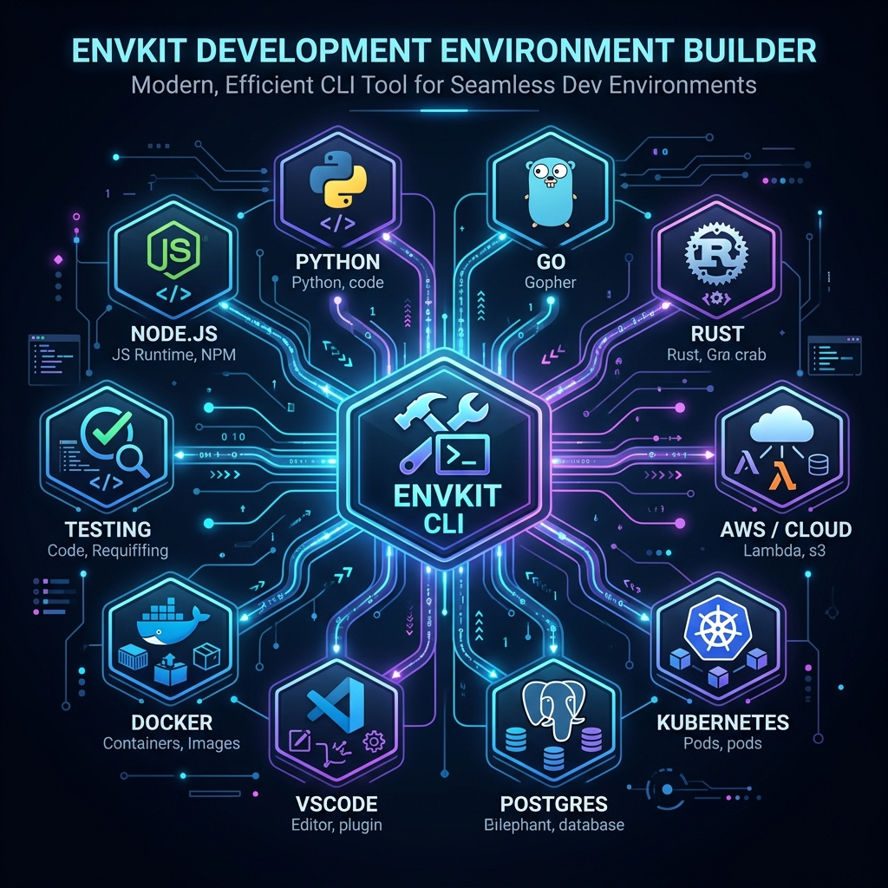

# EnvKit

EnvKit 是一个轻量级、跨平台的本地开发环境一键搭建与配置工具，提供**命令行**和**桌面客户端**两种使用方式。它可以帮助开发者在全新机器上快速部署语言环境、配置国内镜像加速、运行 Docker 常用数据库，并提供一键式无损卸载与环境变量清理能力，实现开发环境的「开箱即用」与「即用即走」。



## 功能特性

### 核心功能
* **多语言一键部署**：支持 Node.js (基于 fnm)、Python (基于 uv)、Go (官方包)、Rust (基于 rustup)、Java (基于 SDKMAN!) 和 Bun。
* **国内镜像自动加速**：自动为各环境配置最快的国内源（如 npmmirror、清华源、中科大源、GoProxy 等）。
* **常用工具集成安装**：支持 Git、Docker、VSCode、Miniconda、kubectl 和 minikube 的静默安装与配置。
* **开发数据库秒级启动**：基于 Docker 一键启动 PostgreSQL、Redis、MySQL 和 MongoDB 容器，自动持久化数据。
* **本地环境智能扫描**：快速扫描并以表格形式清晰展示当前系统中各个工具的安装状态与版本。
* **一键卸载与无痕清理**：自动记录安装路径与注入的环境变量。支持单个组件卸载或全局一键彻底清理（`uninstall --all`），还原干净的系统。

### 桌面客户端 (GUI) 🆕
* **系统原生界面**：纯白背景、轻量化设计、无 AI 风格
* **可视化管理**：
  - **Languages**：管理编程语言环境（Node.js, Python, Go, Rust, Java, Bun）
  - **Tools**：管理开发工具（Git, Docker, VS Code, Miniconda, Kubectl, Minikube）
  - **Database**：管理数据库容器（PostgreSQL, Redis, MySQL, MongoDB）
  - **Environment**：管理系统环境变量（用户变量、系统变量、PATH 管理）
  - **Settings**：系统信息、镜像源配置、通用设置
* **一键启动**：使用 `./start-gui.sh` 快速启动桌面版

## 安装指南

EnvKit 提供了预编译的跨平台二进制文件和桌面安装包，开箱即用，无需预装 Go 语言环境。

### 命令行工具 (CLI)

### macOS / Linux

在终端中执行以下命令进行安装：
```bash
./install.sh
```
脚本会自动识别当前系统的操作系统和架构（支持 Intel / Apple Silicon 芯片），并将二进制文件复制到 `/usr/local/bin`。

### Windows

双击运行根目录下的 `install.bat`，或者在 PowerShell 中执行：
```powershell
.\install.ps1
```
脚本会将 `envkit.exe` 安装到用户目录下的 `~/bin`，并自动将该路径添加到用户 `PATH` 中（安装后需重启终端生效，无需管理员权限）。

## 快速上手

### 1. 查看支持的组件列表
列出所有支持的一键安装环境、开发工具及其在当前系统下的安装状态：
```bash
envkit list
```

### 2. 交互式一键安装
直接运行安装命令（不指定配置文件且本地无默认配置时），EnvKit 将引导进入多选交互菜单：
```bash
envkit install
```

### 3. 声明式配置批量安装
使用 YAML 配置文件进行批量静默安装。你可以基于 `templates/` 目录下的常用环境模板快速开始：

* **安装 Go 环境**：
  ```bash
  envkit install -f templates/languages/go.yaml
  ```
* **安装 Java 环境 (包含 MySQL)**：
  ```bash
  envkit install -f templates/languages/java.yaml
  ```
* **其它预设模板**：可以在 `templates/languages/` 目录下找到 `node.yaml`、`python.yaml`、`rust.yaml`、`bun.yaml`、`miniconda.yaml` 等。

### 4. 本地环境全量扫描
扫描当前系统已安装的语言开发环境、工具软件及可用的包管理器：
```bash
envkit detect
```

### 5. 国内镜像源加速
如果只需单独为特定语言环境配置国内镜像加速，可以直接使用 mirror 命令：
```bash
envkit mirror npm npmmirror   # 配置 npm 淘宝源
envkit mirror pip tsinghua    # 配置 pip 清华源
envkit mirror go goproxy      # 配置 Go 代理
envkit mirror rust ustc       # 配置 Rust 中科大源
```

### 6. 常用数据库一键运行 (Docker)
```bash
# 启动 PostgreSQL 16 数据库容器
envkit docker start postgres 16

# 查看当前运行中的容器
envkit docker list

# 停止指定的容器
envkit docker stop envkit-postgres
```

### 7. 一键卸载与环境清理
EnvKit 会在安装时自动记录安装的路径和配置。当需要清理环境时，可以干净彻底地卸载已安装的组件，移除注入的环境变量，还原系统：
```bash
# 开启交互式卸载菜单，选择需要清理的语言环境或工具
envkit uninstall

# 卸载指定的单个组件并清理其对应的路径和环境变量
envkit uninstall node

# 彻底卸载使用 EnvKit 安装的所有组件，并清理全部相关的环境变量配置
envkit uninstall --all
```

## 配置文件示例

以下是一个完整的环境配置示例（如 `dev-env.yaml`）：

```yaml
version: "1.0"
name: "Full Stack Development"

languages:
  - name: node
    version: "20.11.1"
    mirror: npmmirror
    package_manager: pnpm
  - name: python
    version: "3.10.11"
    mirror: tsinghua
  - name: go
    version: "1.22.0"
    mirror: goproxy
  - name: java
    version: "21"
  - name: bun
    version: "latest"

tools:
  - git
  - docker
  - vscode
  - miniconda

databases:
  - name: postgresql
    version: "16"
    docker: true
  - name: redis
    version: "7"
    docker: true
  - name: mysql
    version: "8.0"
    docker: true

shell:
  type: zsh
  plugins:
    - oh-my-zsh
```

## 延伸阅读

* [ESP-IDF 全平台环境安装配置与部署教程](docs/esp_idf_setup.md)
* [EnvKit 详细使用指南](docs/USAGE.md)
* [EnvKit 架构设计说明书](docs/ARCHITECTURE.md)

## 本地开发与构建

如果你需要修改代码并重新编译：

```bash
# 克隆仓库并安装 Go 依赖
git clone https://github.com/fusheng/envkit.git
cd envkit
go mod download

# 本地编译当前平台的二进制文件
go build -o envkit cmd/envkit/main.go

# 一键跨平台交叉编译所有包（输出到 dist 目录）
# 如果本地没有全局安装 Go，可以使用项目内置的局部 Go 编译器：
PATH="$(pwd)/.go/go/bin:$PATH" ./build.sh
```

## 开源协议

本项目采用 [MIT License](LICENSE) 协议开源。
